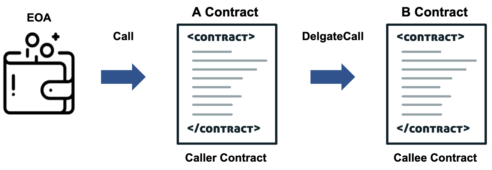

# DelegateCall에 대한 이벤트 데이터도 구독할 수 있나요?

Henesis를 통해 delegateCall로 발생한 이벤트도 구독할 수 있습니다. 구독하는 방법은 컨트랙트 필터의 files 필드에 caller 컨트랙트와 callee 컨트랙트에 대한 정보를 모두 기록해주면 됩니다. A Contract에서 B Contract에 있는 `plus`라는 함수를 delegateCall 하는 경우를 예를 들어 어떻게 이벤트를 구독할 수 있는지 설명하겠습니다.





```javascript
pragma solidity ^0.4.23;

contract AContract {
    function delegateEventCall(address other1) public {
        require(other1.delegatecall(bytes4(keccak256("plus()"))));
    }
}
```



* AContract의 `delegateEventCall` 함수는 callee 컨트랙트인 BContract의 주소를 인자로 받아 `plus` 함수를 delegateCall 합니다.



```javascript
pragma solidity ^0.4.23;

contract BContract {
    event SampleEvent();

    function plus() public {
        emit SampleEvent();
    }
}
```



* BContract의 plus 함수는 `SampleEvent` 이벤트를 emit 합니다.

AContract에서 BContract로 delegateCall하는 이벤트를 구독하고 싶다면 `henesis.yaml` 파일에서 아래와 같이 컨트랙트 필터의 address 필드에는 caller 컨트랙트인 AContract의 주소를 입력하고, files 필드 아래에는 caller 컨트랙트와 callee 컨트랙트에 대한 정보를 모두 기입하면 됩니다.



```yaml
version: v1
name: delegatecall-sample

blockchain:
  platform: ethereum
  network: mainnet
  threshold: 12 # optional.
                # Ethereum: (default: 12, min: 6)
                # Klaytn: (default: 0, min: 0)

filters:
  contracts:
    - address: '0x762a76234AB93Ff0E8AB4F462A53D91fA7E8c728'
      name: AContract
      files: # optional. The events of the contracts listed below can be combined together at this address.
        - path: ./contracts/AContract.sol
          contractName: AContract
          compilerVersion: 0.4.23
        - path: ./contracts/BContract.sol
          contractName: BContract
          compilerVersion: 0.4.23

provider:
  type: webSocket
  timeout: 10000 # optional. (default: 10000, unit: ms)
# if you want to use webhook, you need to place it
#  type: webhook
#  url: https://localhost:8080
#  method: POST
#  headers:
#    Authorization: 'Bearer YOUR-OWN-TOKEN'
```




