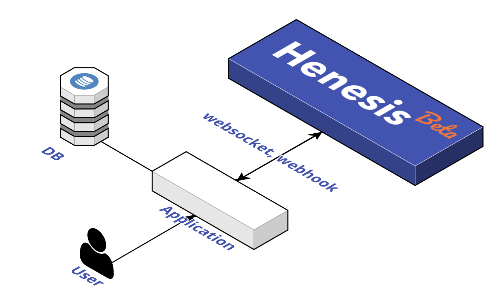

# 導入

## ブロックチェーンイベントとは？

ブロックチェーンイベントを取得する事で、ブロックチェーンでスマートコントラクトの状態を継続的に監視する事が非常に簡単になります。

```javascript
contract Token is ERC20 {
    ...
    function transfer(address recipient, uint256 amount) external returns (bool){
     ...
     emit Transfer(msg.sender, recipient, amount);
    };

    event Transfer(address indexed from, address indexed to, uint256 value);
}
```

`Transfer`イベントを取得することにより、スマートコントラクトで発生したすべての転送を追跡することができます。

## Henesisでイベントを取得するメリット <a id="benefits-of-using-the-henesis"></a>

‌ブロックチェーンイベントを漏れなく取得し、ユーザーに提供するには、イベントを取得するサーバー（Event Subscriber）を用いるのが一般的です。多くのブロックチェーンアプリケーションでは次のようなアーキテクチャを使用してブロックチェーンからイベントをサブスクライブしています。


Henesisは上の図の**Blockchain Node**と**Event Subscriber**の役割を同時に担うSaaSです。したがってHenesisをアプリケーションに組み込めば、ノード提供サービス（Infura、Alchemy等）のBlockchain Nodeからデータを取得するためにWeb3コードなどを書く必要もありません。



それでは、Henesisを介して簡単にイベントを取得する方法を学びんでいきましょう。

