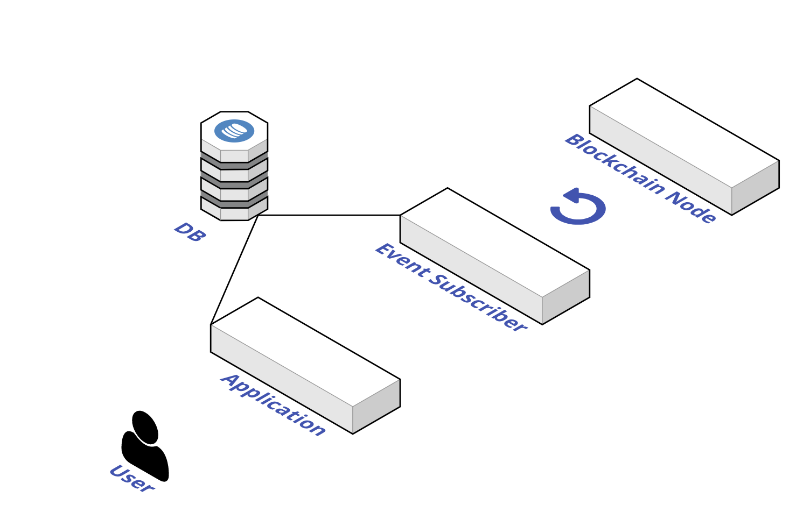

# Introduction

혹시 블록체인 어플리케이션을 개발하다가 아래와 같은 어려움을 겪으신 적이 있으신가요?

* 블록체인에 기록된 이벤트를 유실없이 구독했는지 불확실하다. 
* 트랜잭션을 블록체인 네트워크에 전송 했는데 제대로 채굴 됐는지 확인하기 어렵다.
* 블록체인 노드와 연결이 끊겨서 데이터를 올바르게 가져오기 어렵다. 

위와 같은 어려움을 해결하기 위해 Henesis는 다음과 같은 기능들 제공합니다.

* 유실없는 블록체인 데이터 구독
* Reorganization Tolerance
* 고가용성 블록체인 노드 제공

아직 어떤 게 편해진지 모르시겠나요? 만약 Henesis가 없다면 여러분들은

* 안정적인 블록체인 노드를 직접 운영해야 합니다.
* 블록체인 데이터 구독을 위한 코드를 직접 작성해야 합니다.
* 블록체인 데이터 구독을 위 필요한 인프라를 직접 운영해야 합니다. 
* 지금 구독한 블록체인 데이터가 Chain Reorgnization으로 인해 변경되지 않을지 확인해야 합니다.
* 트랜잭션 추적을 위해 매번 트랜잭션 풀이나 최신 블록의 정보를 가져와서 그곳에 내 트랜잭션이 담겨있는지 확인해야 합니다.

Henesis 서비스를 이용하면 이 모든 것들을 신경 쓸 필요가 없습니다. 이 문서는 이제부터 얼마나 간단하게 블록체인 데이터를 다룰 수 있는지 여러분께 안내드리겠습니다. 

## 블록체인 이벤트란?

블록체인에서 스마트 컨트랙트의 상태를 지속적으로 모니터링 하기 가장 쉬운 방법은 바로 이벤트를 듣는 것입니다. 

```javascript
contract Token is ERC20 {
    ...
    function transfer(address recipient, uint256 amount) external returns (bool){
     ...
     emit Transfer(msg.sender, recipient, amount);
    };

    event Transfer(address indexed from, address indexed to, uint256 value);
}
```

위와 같은 토큰 스마트 컨트랙트에서 `Transfer`이벤트를 구독한다면 토큰의 모든 전송을 추적할 수 있습니다.

## Henesis를 통한 이벤트 구독의 장점

블록체인 이벤트를 빠짐없이 구독하여 사용자에게 제공하기 위해서는 이벤트를 구독하는 서버\(Event Subscriber\)를 운영하는 것이 일반적입니다. 많은 블록체인 어플리케이션들이 아래와 같은 아키텍처를 통해 블록체인으로부터 이벤트를 구독합니다.



Henesis는 위의 Diagram에서 **Blockchain Node** 와 **Event Subscriber**를 대체할 수 있는 SaaS 입니다. Henesis를 사용하면 Web3 코드를 작성해 노드 제공 서비스들\(Infura, Alchemy 등\)의 Blockchain Node로부터 데이터를 가져오는 로직을 작성할 필요가 없습니다. 


자, 이제 Henesis를 통해 쉽게 이벤트를 구독하는 법을 알아봅시다.

