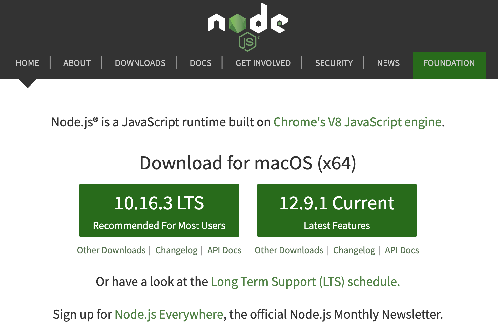

# Node.js 및 npm 설치

Node.js는 Chrome V8 Javascript 엔진으로 빌드된 Javascript 런타임으로서 웹 브라우저 외부에서 자바스크립트를 실행하는 환경입니다. Henesis 이용하여 프로젝트를 개발하려면 Node.js가 필요합니다. 


Henesis 사용하기 위해서는 최소 버전 10 이상의 Node.js가 설치되어 있어야 합니다.


### Mac 사용자를 위한 설치 방법

Mac 사용자는 [**nvm**](https://github.com/nvm-sh/nvm)을 통해 Node.js를 설치하는 것이 가장 좋습니다. nvm을 설치하려면 먼저 Xcode Command Line Tools을 설치해야 합니다. 터미널에 아래 명령어를 입력하여 필요한 구성요소를 설치하세요:

```bash
$ xcode-select --install
```

위 명령어를 통해 Xcode Command Line Tools 설치가 완료되었다면 터미널을 이용해 nvm을 설치하세요. 다른 설정 및 옵션들은 nvm repository를 확인하세요.

```bash
$ curl -o- https://raw.githubusercontent.com/nvm-sh/nvm/v0.34.0/install.sh | bash
```

nvm 설치가 성공적으로 완료되면 아래 명령어를 입력하여 Node.js를 설치합니다.

```bash
$ nvm install --lts
```

Node.js 설치가 완료되면 아래 명령어를 입력하여 제대로 설치되었는지 확인합니다.

```bash
$ node --version && npm --version
v10.15.3
6.4.1
```

### Windows 사용자를 위한 설치 방법

Windows 사용자는 설치 파일을 이용하여 Node.js를 설치하는 것이 좋습니다.

[Node.js official site](https://nodejs.org/en/)에서 LTS 버전을 다운로드 할 수 있습니다. Node.js 설치가 완료되면 powershell에서 사용할 수 있으며 아래와 같은 명령어로 버전을 확인할 수 있습니다.



```bash
$ node --version && npm --version
v10.15.3
6.4.1
```

