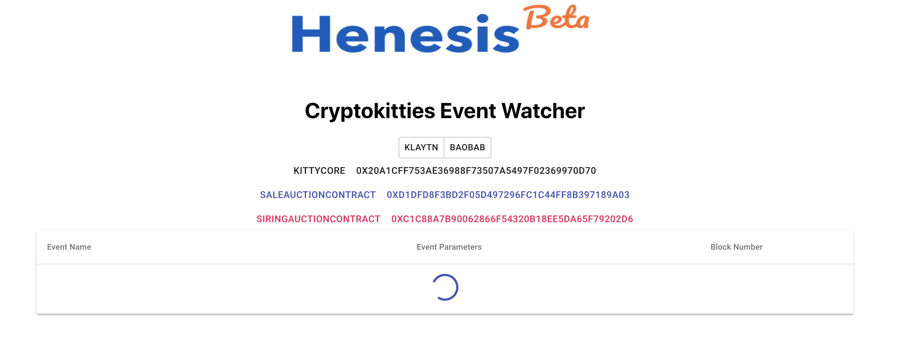

# 실행하기

## Dependency 설치하기



```bash
npm run installAll
```



## 프론트엔드와 백엔드 실행하기 



```bash
npm run start
```





```bash
npm run dev
```



## 확인하기

위의 명령어를 입력한다면 아래와 같이 실행 되는지 확인해주세요.

#### 프론트엔드 



```bash
Compiled successfully!

You can now view app in the browser.

  Local:            http://localhost:3000/
  On Your Network:  http://192.168.0.41:3000/

Note that the development build is not optimized.
To create a production build, use yarn build.
```






#### 백엔드 



```bash
MacBook-Pro-10:backend henesis$ npm run dev

> express-es6-rest-api@0.3.0 dev /Users/henesis/tutorial/backend
> nodemon -w src --exec "babel-node src --presets es2015,stage-0"

[nodemon] 1.19.2
[nodemon] to restart at any time, enter `rs`
[nodemon] watching dir(s): src/**/*
[nodemon] starting `babel-node src --presets es2015,stage-0`
Started on port 8080
```



