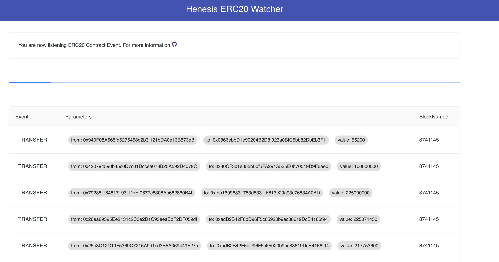

# Event Streamer

## Step 1: Install Henesis CLI

### Installation

```bash
npm install -g @haechi-labs/henesis-cli
```

### Login with your Henesis account

```bash
henesis login
```

## Step 2: Clone the Sample Code.

### Clone the sample repository

```
git clone https://github.com/HAECHI-LABS/sample-erc20-watcher
```

### Move to sample directory

```
cd sample-erc20-watcher
```

### Install dependencies

```
npm install
```

## Step 3: Register Blockchain Data Filter

To subscribe the blockchain data without losing data using Henesis, it is necessary to record in the filter which contract's events will be listened to. Filter registration can be done through `henesis.yaml`, and the sample code demonstrates how to use Henesis by subscribing to events from the [TetherToken contract](https://etherscan.io/address/0xdac17f958d2ee523a2206206994597c13d831ec7), which is distributed on the Ethereum mainnet.



```yaml
name: tether-tutorial
version: v1    # (TBD) The version of this yaml file.
apiVersion: v1 # (TBD) The version of Henesis api. The type of message you receive can be changed depending on this version.

blockchain:
  platform: ethereum
  network: mainnet
  threshold: 6  # optional.
                # ethereum: (default: 12, min: 6)
                # klaytn: (default: 0, min: 0)

filters:
  contracts:
    - address: '0xdac17f958d2ee523a2206206994597c13d831ec7'
      name: TetherToken
      files: # The events of the contracts listed below can be combined together at this address.
        - path: ./contracts/TetherToken.sol
          contractName: TetherToken
          compilerVersion: 0.4.18

provider:
  type: webSocket
```



## Step 4: Deploy your Integration

You can deploy your [integration](https://docs.henesis.io/v/ko/subscribing-events/deploy-integration#integration) using the following CLI command.

```bash
henesis integration:deploy
```

If the integration has been successfully deployed, you will see something like this:

```text
Deploying... !
tether-tutorial-jrweu has been deployed
Deploying... done
```

You can check the state of the integration through the CLI command. If the `state` is marked as `Available`, the integration is successfully deployed.

```bash
henesis integration:status
```

```text
Id                     Name             Platform  Network  Version  Provider   State
tether-tutorial-jrweu  tether-tutorial  ethereum  mainnet  v1       webSocket  Available
```

## Step 5: Check for the Event Data

### Configuration for ClientId, IntegrationId

To subscribe the event data of blockchain through Henesis, you need the following information:

* `CLIENT_ID` : You can check it through the `henesis account:describe` command.
* `INTEGRATION_ID` : You can check it through the `henesis account:describe` command.

The ClientId can be checked using the following CLI command.

```text
henesis account:describe
```

```text
Email: haechi@haechi.io
Name: haechi
Organization: haechi-labs
ClientId: a481485a958f1b82ac210ec4eea27943
```

The IntegrationId can be checked using the following CLI command.

```bash
henesis integration:status
```

```text
Id                     Name             Platform  Network  Version  Provider   State
tether-tutorial-jrweu  tether-tutorial  ethereum  mainnet  v1       webSocket  Available
```

 Enter the ClientId and IntegrationId in the `.env` configuration file.



```javascript
CLIENT_ID=<your client id>
INTEGRATION_ID=<your integration id>
```



### Build and run the sample code

Build your source code using npm.

```bash
$ npm run build:standalone
```

Run your API server.

```bash
$ node index
```

Check [http://locahost:3000](http://locahost:3000) in your browser and make sure you are subscribed to the Event data.




See [here](https://docs.henesis.io/v/ko/faq/json-schema) for raw data of subscribed blockchain data..


