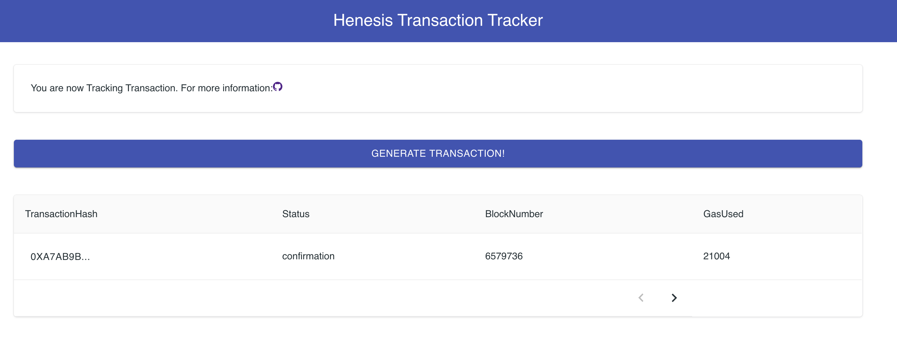

# \[チュートリアル\] Tx Tracker

## Tx Trackerについて

Tx Trackerは、トランザクションを追跡する簡単なダッシュボードです。このダッシュボードを使用して以下のことができます。

* トランザクションを作成してブロックチェーンネットワークに伝達する
* 発生させたトランザクションの状態をダッシュ​​ボードで確認する



## プロジェクトの構造


```bash
sample-tx-tracker/
├── /config          
├── /helper  # helper library for make transaction         
├── /public          
├── /src # frontend code
├── .env # configuration file
├── index.js   # API server code
├── jsconfig.json      
├── package.json    
...
```


* APIサーバーは、次のようなインターフェイスを持っています。
  * **POST** `/api/tx`: トランザクションを作成し、ブロックチェーンネットワークに伝播します。
  * **GET** `/api/tx` : ネットワークに伝播したすべてのトランザクションの状態値を返します。
* Frontend 
  * APIサーバーの**GET** `/api/tx`を継続的に調査して、トランザクションの状態を更新します。
  * ユーザが`Generate Transaction`ボタンを押すと、POST `/ api / tx`要求をAPIサーバーに送信します。

## ステップ

1. サンプルリポジトリのインポート


   ```bash
   git clone https://github.com/HAECHI-LABS/sample-tx-tracker
   ```

2. 依存関係のパッケージをインストールする


   ```bash
   npm install
   ```

3. `.env`を変更する

   * `CLIENT_ID` : `henesis account：describe`で確認することができます。
   * `PRIVATE_KEY` : テストのために使用されるプライベートキーです。十分な量のイーサリアムがあるEOAアドレスのプライベートキーを入力します。
   * `NODE_ENDPOINT` : 接続したいブロックチェーンのノードのURLです。 （現在はropstenのみをサポートします。）

   ```javascript
   CLIENT_ID=your-client-id
   PRIVATE_KEY=your-private-key
   NODE_ENDPOINT=https://ropsten.infura.io/v3/<your-key>
   ```

4. ソースコードをビルドする

   ```text
   npm run build:standalone
   ```

5. サーバーを実行して、ブラウザに[http://localhost:3000](http://localhost:3000)を開きナビゲート


   ```text
   node index.js
   ```

## 動作原理

#### Transactions tracker through the Henesis SDK

`index.js`が、今回のチュートリアルで最も重要な部分です。ここでHenesis SDKを活用して、トランザクションの状態を追跡します。

`CLIENT_ID`を利用して、データの取得を行うためにHenesisインスタンスを生成します（参照）。


```javascript
const { CLIENT_ID, PRIVATE_KEY, NODE_ENDPOINT } = process.env;
const henesis = new Henesis(CLIENT_ID);
```


APIサーバーが`henesis＃trackTransaction`を利用してトランザクションを追跡します（参照）。 

* トランザクションを発生させ`txHash`を取得します。
* `txHash`を`henesis＃trackTransaction`に入れ追跡を開始します。
* `timeout` を30秒、`confirmation`を6に設定します。


```javascript
app.post('/api/tx', async function(req,res) {
  // Generate a transaction
  const sender = new Sender(PRIVATE_KEY, NODE_ENDPOINT);
  const nonce = await sender.getNonce();
  const txHash = await sender.send(nonce);
  console.log(`transaction generated. txHash:${txHash}`);

  // Track the transaction status
  henesis.trackTransaction(txHash, {
    timeout: 30*1000, //30s
    confirmation: 6 
  });
  transactions[txHash] = { status: "registered" };
  res.json(transactions); 
});
```


`subscription`を利用して追跡したトランザクションの状態を取得することができます。

* `message.data.type`で追跡したトランザクションの状態を知ることができます。
* `message.ack（）`を最後に必ず呼び出さなければいけません。


```javascript
async function trackTx () {
  const subscription = await henesis.subscribe(
    "transaction",
    {
      subscriptionId: "your-subscription-id"
    }
  );

  subscription.on("message", async (message) => {
    console.log(`now transaction status is: ${message.data.type}`)
    switch(message.data.type) {
      case 'pending' : 
        transactions[message.data.result.transactionHash] = { status: 'pending'}
        break;
      case 'receipt' : 
        console.log('message.data.result',message.data.result)
        transactions[message.data.result.transactionHash] = { ...message.data.result, status: 'receipt' }
        break;
      case 'confirmation' : 
        console.log('message.data.result',message.data.result)
        transactions[message.data.result.transactionHash] = {...message.data.result, status: 'confirmation' }
        break;
    }
    message.ack();
  });

  subscription.on("error", async (error) => {
    console.log('err',error)
  });
}
```



