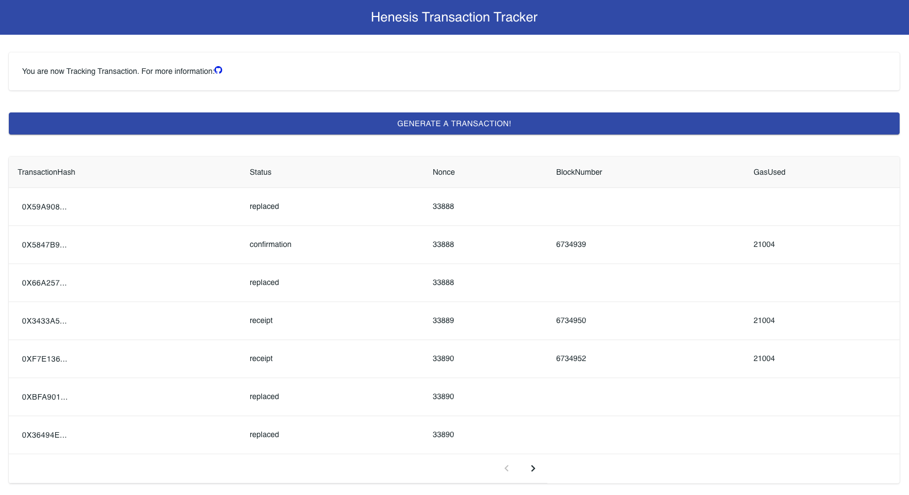

# \[Tutorial\] Replacing Pending TXs

## Tx-Tracker

Learn how to use and utilize the Tx Tracker. Through this tutorial you would able to

* Learn how to use Tx-Tracker
* use Tx-Tracker to auto-resolve a pending transactions

It also provides a dashboard for the smooth progress o the tutorial. Through this dashboard you would able to

* Generate transactions and send them to the blockchain network.
* Track the state of transactions via the dashboard.




The tutorial uses a status called `replaced` , which is not provided by the Tx-Tracker , to show how a pending transaction will auto-resolved. There are [two main cases](https://docs.henesis.io/transaction-tracker/introduction#transaction-status) in which a transaction becomes a pending. In this case, to prevent pending state for a long time, you can create new transaction with same nonce, higher gas price. The transaction which lost in the mining competition is defined as a `replaced`.


## Project Structure



```bash
sample-tx-tracker/
├── /config          
├── /helper  # helper library for make transaction         
├── /public          
├── /src     # frontend code
├── /types   # types used in index.js
├── /store   # transaction store used in index.js
├── .env     # configuration file
├── index.js # API server code
├── jsconfig.json      
├── package.json
...
```



* The API server has following interfaces
  * **POST** `/api/tx`: Generate transactions and propagate them to the blockchain network.
  * **GET** `/api/tx` : Return all the status of transactions propagated to the network.
* Frontend 
  * Keep polling the **GET** `/api/tx` for updating transaction status.
  * When users click `Generate a transaction` button, it sends a POST `/api/tx` request to the API server.

## Step By Step

1. Clone the sample repository

   ```
   git clone https://github.com/HAECHI-LABS/sample-tx-tracker
   ```

2. Install dependencies

   ```
   npm install
   ```

3. Modify the `.env`

   * `CLIENT_ID` : Your client id. You can check it through the `henesis account:describe` command.
   * `PRIVATE_KEY` : A private key of your EOA account for test. **The** **EOA account should have enough ETHs to send transactions.**
   * `NODE_ENDPOINT` : The URL of the blockchain node you want to connect.
   * `PLATFORM`: Select the platform you want. Supported platforms and networks can be found [here](https://docs.henesis.io/faq/supported-blockchains).
   * `NETWORK`: Select the desired network.

   ```javascript
   CLIENT_ID=<your-client-id>
   PRIVATE_KEY=<your private key>
   NODE_ENDPOINT=https://ropsten.infura.io/v3/<your-key>
   PLATFORM=ethereum
   NETWORK=ropsten
   ```

4. Build source codes

   ```
   npm run build:standalone
   ```

5. Run the server and browse [http://localhost:3000](http://localhost:3000)

   ```
   node index.js
   ```

## How does it works?

#### Transactions tracker through the Henesis SDK

The`index.js` plays a key role in this tutorial. It monitors transactions via the Henesis SDK.

You can use the `CLIENT_ID` to authenticate with Henesis Server, and set up your preferred platform and network to create Henesis instances for data subscription.



```javascript
const {CLIENT_ID, PRIVATE_KEY, NODE_ENDPOINT, PLATFORM, NETWORK} = process.env;
const tracker = new TransactionTracker(CLIENT_ID, {
  platform: PLATFORM,
  network: NETWORK
});
```



The API server uses `henesis # trackTransaction` to track the transactions. 

* Generate transactions and receive `txHash`.
* Initiate to track transactions by putting `txHash` into `henesis#trackTransaction`
* Set `timeout`and `confirmation`.



```javascript
app.post('/api/tx', async function (req, res) {
  //Generate Transactions
  const nonce = await sender.getNonce();
  const transactionHash = await sender.send(nonce, GAS_PRICE);
  console.log(`transaction generated. txHash:${transactionHash}`);

  //start tracking transaction
  await tracker.trackTransaction(transactionHash, {
    timeout: TIMEOUT,
    confirmation: CONFIRMATION
  });

  const transaction = new Transaction(
    transactionHash,
    nonce,
    GAS_PRICE
  );
  transactionStore.save(transaction);
  await res.json(transaction);
});
```



At last, you can subscribe to the status of transactions through `subscription`

* You can check the status of a transaction through the `message.data.type` .
* You can see information about tracked transactions in `message.data.type`.
* The `message.ack()` should be called when data processing is done.

There are three statuses tracked on the Tx-Tracker: `pending`, `receipt`, and `confirmation`. If `pending` status, execute logic to resolve the transaction. Check the nonce of previous transactions and proceed to resolve if the transaction needs to be resolved.


The current Tx-Tracker does not provide transaction data when the transaction is in the `pending` state. That's why we use the TransactionStore for auto-resolving.




```javascript
async function trackTx() {
  const subscription = await tracker.subscribe(
    "transaction",
    {
      subscriptionId: "your-subscription-id",
      ackTimeout: 30 * 1000 // default is 10 * 1000 (ms)
    }
  );

  subscription.on("message", async (message) => {
    const transactionHash = message.data.result.transactionHash;
    let transaction = {};
    console.log(`[MESSAGE] transaction ${transactionHash} status is: ${message.data.type}`)
    switch (message.data.type) {
      case 'pending' :
        transaction = transactionStore.findByHash(transactionHash);
        if (transaction.status == undefined) {
          transaction.status = Status.pending;
        }
        if (isNeededResolve(transaction)) {
          const newTransaction = await retry(transaction);
          transactionStore.save(newTransaction);
        }
        break;
      case 'receipt' :
        transaction = transactionStore.findByHash(transactionHash);
        checkResolvedTransaction(transaction);
        transaction.status = Status.receipt;
        transaction.data = {...message.data.result};
        transactionStore.save(transaction);
        break;
      case 'confirmation' :
        transaction = transactionStore.findByHash(transactionHash);
        transaction.status = Status.confirmation;
        transaction.data = {...message.data.result};
        transactionStore.save(transaction);
        break;
    }
    message.ack();
  });

  subscription.on("error", async (error) => {
    console.log('err', error);
  });
}
```




